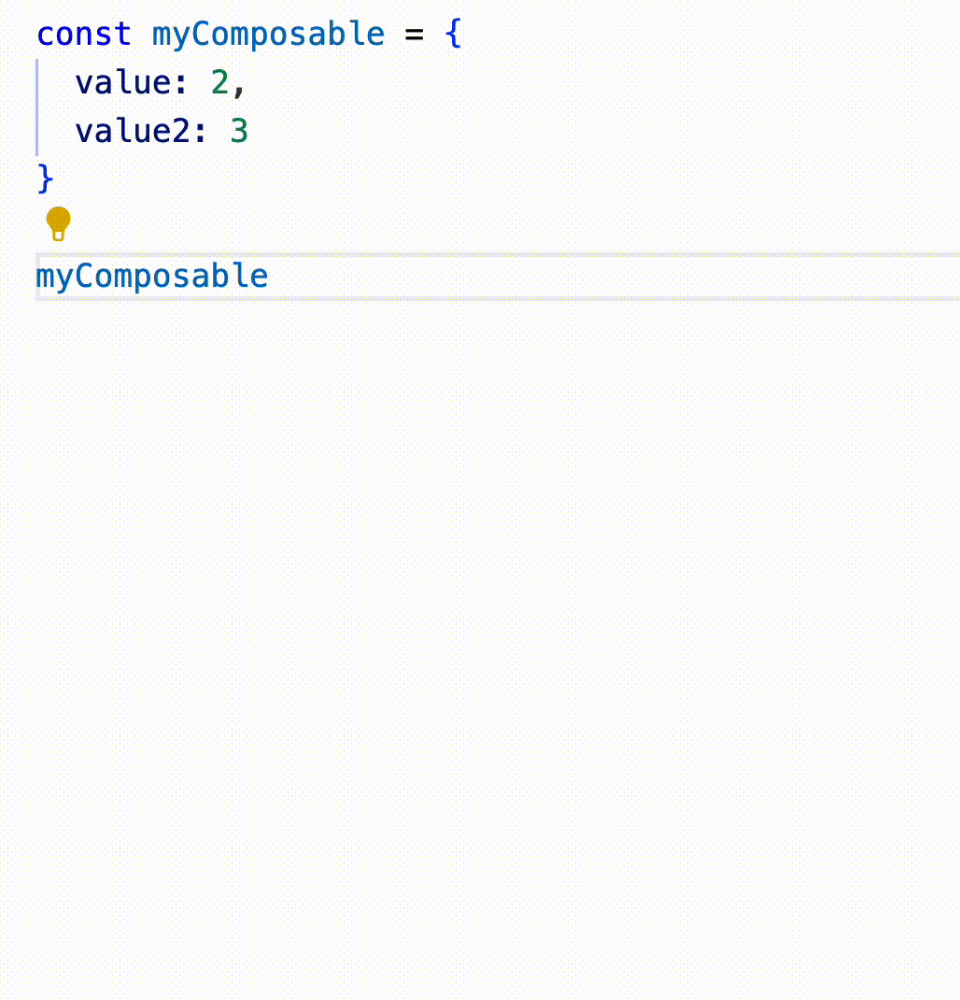
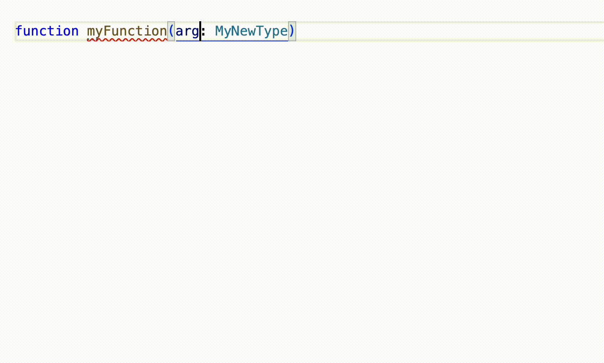

# destructure-snippets-js README

Destructure your variables and your arguments with this simple refactoring extension!

## Features

Use the refactor menu of vscode to find the destructuration option.

By default is menu is accessible with the Cmd + shift + r shortcut on mac

## Requirements

No requirements

## Extension Settings

No contributions, loads on startup.

## Coming soon

Array destructuring of hooks

## Known Issues

## Release Notes
- 0.0.6 - Rename

- 0.0.5 - Improvements

- 0.0.4 - destructuring of existing assignment

- 0.0.3 - readme.md improvement

- 0.0.2 - vue and jsx compatibility

- 0.0.1 - Initial commit